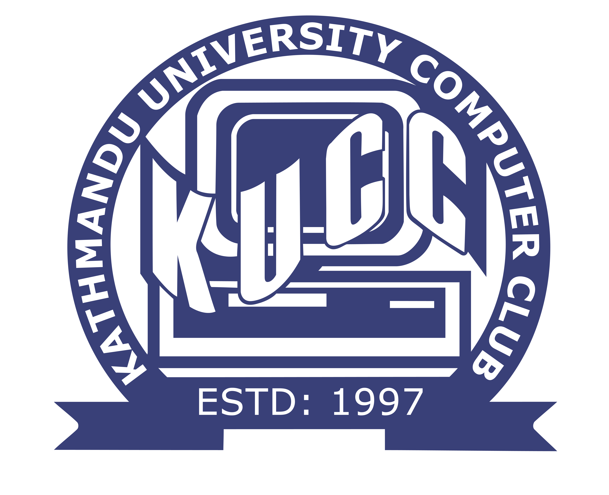

    

<h1 align="center" style="border: 0;">Kathmandu University Students' Projects</h1>

This repository contains the curated list of open-source projects done by Kathmandu University students. Check [Contribution](#contribution) to know how to contribute to this repository.

This repository is started to celebrate [Hacktoberfest 2020](https://hacktoberfest.digitalocean.com/) movement.

## Table of Contents

- [Major Projects](#major-projects)

  - [First Year](#first-year)
  - [Second Year](#second-year)
  - [Third Year](#third-year)
  - [Fourth Year](#third-year)

- [Mini Projects](#mini-projects)
  - [Database Management Systems](#database-management-systems)
  - [Artificial Intelligence](#artificial-intelligence)
  - [Computer Graphics](#computer-graphics)

- [Open Source Projects](#open-source-projects)
  - [VS Code Extensions](#extensions)
- [Contribution](#contribution)
- [License](#license)

## Major Projects

### First Year

- #### [Scientific Calculator](https://github.com/saileshbro/scientific-calculator-qt)

  This is a scientific calculator built with `C++` using [Qt framework](https://www.qt.io/product/framework).

  

### Second Year

- #### [Kam Nepal](https://github.com/saileshbro/kamnepal)

  Kam Nepal is a job portal website which was created using `PHP`.

  

- #### [Hami Nirogi](https://github.com/saileshbro/nirogi)

  Hami Nirogi is a mobile application that provides health-related statistics, such as illness details, signs and medication statistics. It offers search options for multiple medications and gives information about the dose, the generic name, and other health-related information.

  The app is built with [Flutter](https://flutter.dev) and [Node.js](https://nodejs.org/en/). You can try the application by installing apk file from [releases](https://github.com/saileshbro/nirogi/releases/tag/v0.1-beta).

   
  
- #### [My Medilog](https://github.com/awanshrestha/medilog)

  My Medilog is a health portal system that helps users with digitalized record of their health reports and information. It allows doctors to update the patient health information and patients can access their past medical records, medications and upcoming appointments with doctors.

  The app is built with [Node.js](https://nodejs.org/en/).

  

### Third Year

- #### [Cognifeed](https://github.com/saileshbro/cognifeed)

  Cognifeed is an information aggregator program that attempts to make you smarter in this stressful environment.

  The app is built with [Flutter](https://flutter.dev) and [Node.js](https://nodejs.org/en/). You can try the application by installing apk file from [releases](https://github.com/saileshbro/cognifeed/releases/tag/v1.0).

  

- #### [nutri.gram](https://github.com/saileshbro/nutri.gram)

  nutri.gram is a mobile application that scans the food label present in the packaged food items and draws a significant conclusion from that data regarding its edibleness for a person, the nutritional worth it adds to our diet, how much calorific value it provides per serving and much more. This application is targeted to anyone who wants to get insight into what they are feeding into their body and how understanding the nutritional value will be of tremendous aid to their overall health.

  The app is built with [Flutter](https://flutter.dev) and [Node.js](https://nodejs.org/en/).

  
  
- #### [Visit Nepal 2020](https://github.com/TimilsinaBimal/Visit-Nepal-2020)

     Visit Nepal 2020 is a web application targeted for the campaign Visit Nepal 2020 (later postponed to 2022 due to COVID 19). This project helps tourists to find the places based on District, popularity and so on. It also has features like Activities to do in that place, Currency Converter, News about Tourism and places, Social Networking site to connect with other people and so on. Users can rate the places. There are a list of Hotels to stay in, with the prices so that they can easily decide where to stay. 
        *Note: We have Used dummy data for testing purpose.*

  The app is built with [Django](https://www.djangoproject.com/).

  
  

### Fourth Year
- #### [KUSIMS](https://github.com/sigdelsanjog/KUSIMS)

    Kathmandu University Student Information Management System is actually a semeter proejct we gradaute student Batch 2018 did as a part of the course Sorftware Engineering. This project is developed in Laravel Framework with various features like Department, Program and Batch Management, Student Grades and Attendance, Hostel Management, Employee and Job type Management, Bus management, Course Assignment & Addition of Notice, Using permissions via roles etc.
    
    The app is built with [Laravel](https://laravel.com/).
    
    
    

## Mini Projects

### Database Management Systems

- #### [Restaurant DBMS](https://github.com/saileshbro/restaurant-dbms)

  Database project for 4th semester using `Node.js` and `MySQL`

  The app is built with [MySQL](https://www.mysql.com) and [Node.js](https://nodejs.org/en/).

  
  
  
### Artificial Intelligence

- #### [SMS Spam or Ham Detector](https://github.com/maladeep/sms-spam-ham-detector)

  A simple web app to detect SMS as spam or ham(not spam) using `Python Flask` and `Naïve Bayes classifiers` for IV/I year/semester Artificial Intelligence course (COMP 472).
  
  The app is built with [Python Flask](https://flask.palletsprojects.com/en/1.1.x/) and [Bootstrap](https://getbootstrap.com/).
  
    **Blog at:** [Towards Data Science](https://towardsdatascience.com/the-ultimate-guide-to-sms-spam-or-ham-detector-aec467aecd85)
 
     **Live at:** [Spam or Ham SMS Detector](https://sms-spam-ham-detector.herokuapp.com)

    
    
### Computer Graphics

- #### [Double Pendulum Simulation](https://github.com/saileshbro/double-pendulum-simulation)

  This is a double pendullum simulation application with [p5.js](https://p5js.org/), built as a Mini Project for Computer Graphics (COMP 342).

  You can view the live demo [here](https://saileshbro.github.io/double-pendulum-simulation/).

  

## Open Source Projects

### VS Code Extensions

- #### [Angular Dart](https://github.com/aadarshadhakalg/ADSnippets)

  This is the first VS Code extension for the Google's frontend framework [Angular Dart](https://www.qt.io/product/framework).The aim of this extension is to provide fast, easy and bugfree Angular Dart development experience. 

  
  
  
  

## Contribution

If you want to add your projects or want to contribute in any way. Please feel free to send a PR.

- Fork this repository
- make a `your-username-project` branch and add your project details
- Send a pull request to `main` branch and wait for it to be merged.
- Please make sure all the links you add are correct.

Contributions, issues and feature requests are welcome. If you want make some changes / improvement in this project, please consider opening an issues first.

## License

